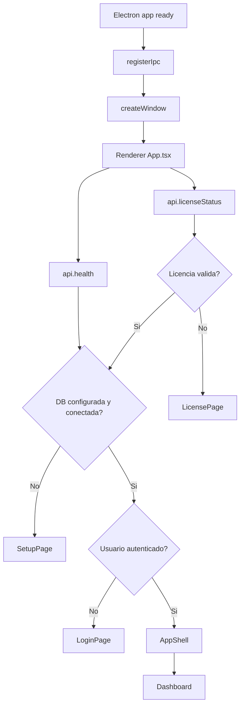
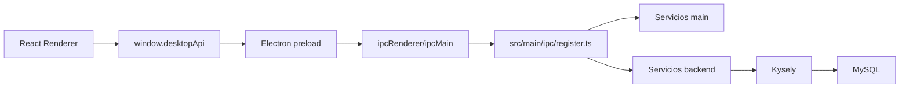
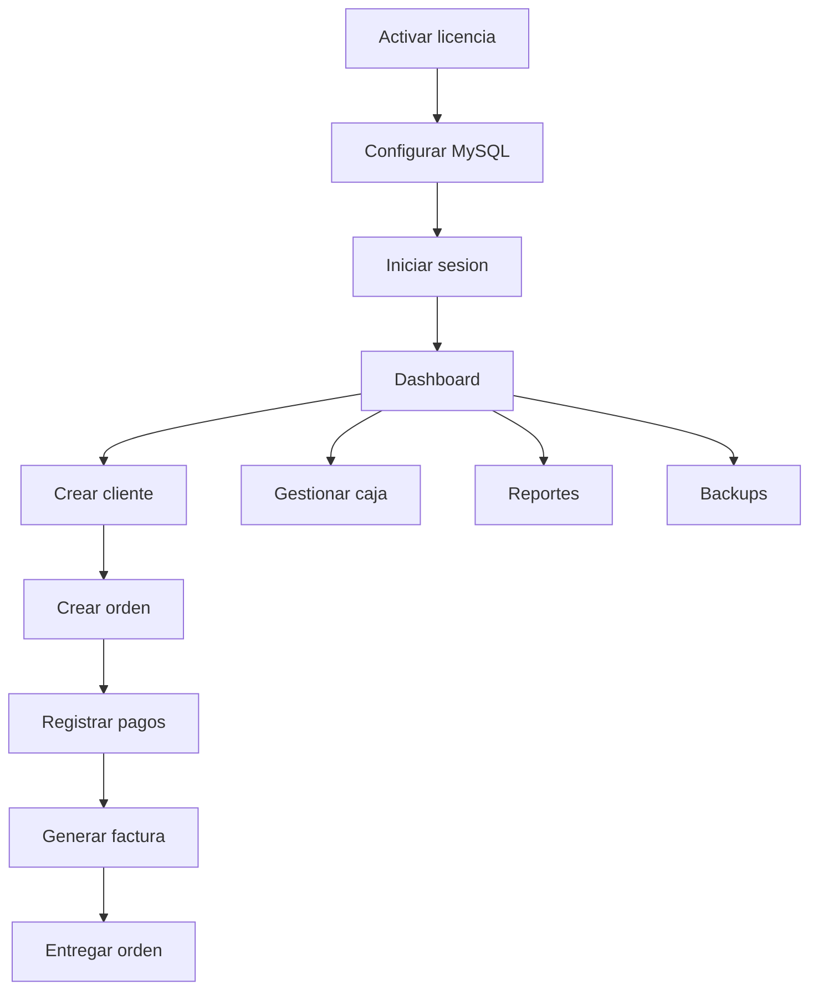
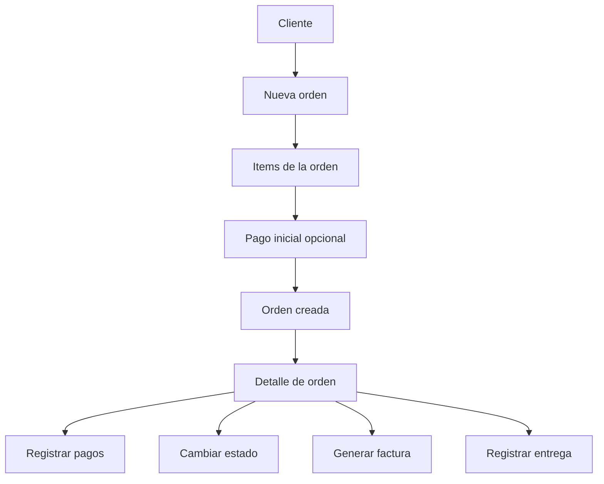
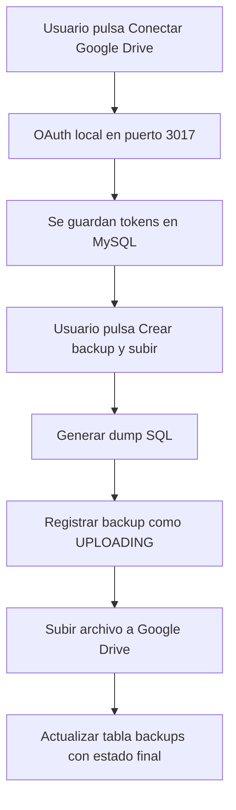

# Documentacion Tecnica de LavaSuite

## Resumen

LavaSuite es una app de escritorio construida con Electron + React + TypeScript + Node.js.
La UI corre en el renderer, la logica de sistema corre en el proceso principal de Electron y la persistencia principal del negocio vive en MySQL.

Capas principales:

- `src/renderer`: interfaz, navegacion, formularios y consumo de API expuesta por `preload`
- `src/main`: ventana Electron, `preload`, registro IPC y servicios del sistema
- `src/backend`: servicios de negocio, acceso a base de datos, migraciones y esquema
- `src/shared`: tipos compartidos entre renderer y main

## Stack real del proyecto

- Electron
- React 18
- TypeScript
- Vite
- React Router con `HashRouter`
- TanStack Query
- Kysely
- MySQL (`mysql2`)
- `electron-store`
- `electron-builder`
- `electron-updater`
- Supabase Functions para licencias
- Google Drive API para backups

## Flujo de arranque de la app

La secuencia real al abrir la app es esta:

Orden exacto de pantallas:

1. `Cargando aplicación...`
2. `Validando licencia...`
3. Si no hay licencia valida: `LicensePage`
4. Si la licencia esta bien pero no hay DB: `SetupPage`
5. Si DB ok pero no hay sesion: `LoginPage`
6. Si todo esta bien: `AppShell` + `DashboardPage`

## Que hace la pantalla inicial

La primera pantalla funcional no siempre es el login.
Depende del estado del sistema:

- Si falta licencia: muestra activacion de licencia
- Si la licencia es valida pero falta conexion MySQL: muestra configuracion inicial
- Si la DB ya esta configurada: muestra login
- Despues del login entra al dashboard

## Siguiente vista y siguientes

Despues del login la ruta inicial es `/`, que corresponde a `DashboardPage`.

Desde el menu lateral el flujo normal de operacion es:

1. `Dashboard`
2. `Clientes`
3. `Órdenes`
4. `Órdenes > Nueva orden`
5. `Órdenes > Detalle`
6. Desde detalle se conectan `Pagos`, `Facturas`, `Entregas` y cambio de estado
7. `Caja`, `Gastos`, `Garantías`, `Reportes`, `WhatsApp`, `Configuración`

## Navegacion disponible

Rutas actualmente registradas:

- `/` Dashboard
- `/clientes`
- `/ordenes`
- `/ordenes/nueva`
- `/ordenes/:orderId`
- `/pagos`
- `/facturacion`
- `/facturas/:orderId`
- `/caja`
- `/entregas`
- `/gastos`
- `/garantias`
- `/inventario`
- `/reportes`
- `/whatsapp`
- `/configuracion`
- `/auditoria`

## Arquitectura de datos

## Flujo de datos por capa

### 1. Renderer

El renderer nunca habla directo con Node ni con MySQL.
Consume funciones expuestas por `window.desktopApi`.

Ejemplos:

- `api.listOrders()`
- `api.openCashSession()`
- `api.uploadBackupToDrive()`
- `api.activateLicense()`

### 2. Preload

`src/main/preload.ts` publica la API segura al navegador embebido.

Esto desacopla la UI del acceso directo a Node y permite mantener `contextIsolation: true`.

### 3. IPC

`src/main/ipc/register.ts` recibe los llamados del renderer, los envuelve en respuestas tipo:

- `success: true, data`
- `success: false, error`

### 4. Servicios

Hay dos grupos:

- `src/main/services`: licencias, impresoras, backup, DB manager
- `src/backend/modules/*`: logica de negocio por modulo

### 5. Base de datos

La app usa MySQL con Kysely.
La conexion se guarda localmente con `electron-store`.
Las migraciones SQL se ejecutan automaticamente desde `databaseManager.healthCheck()` y `databaseManager.migrate()`.

## Flujo de trabajo del usuario

## Licencias

Si, la app si esta manejando licencias.

Implementacion actual:

- Servicio: `src/main/services/license-service.ts`
- UI de activacion: `src/renderer/modules/license/pages/LicensePage.tsx`
- Validacion al arranque: `src/renderer/App.tsx`

Como funciona:

1. Se genera un `machineId` con hostname + plataforma + arquitectura
2. Se llama una Supabase Function llamada `validate-license`
3. Si responde valido, se cachea localmente en `electron-store`
4. Si luego falla internet, hay una gracia offline de hasta 72 horas desde la ultima validacion
5. Si no hay licencia valida, la app bloquea el acceso a todo lo demas

Datos cacheados:

- `licenseKey`
- `expiresAt`
- `daysLeft`
- `lastValidatedAt`
- `planType`
- `businessName`
- `phone`

Observaciones:

- La licencia si bloquea toda la app
- Hay banner de renovacion cuando faltan pocos dias
- La compra de licencia redirige a WhatsApp

## Configuracion inicial

`SetupPage` aparece cuando la app no tiene conexion MySQL guardada o no logra conectarse.

Campos:

- host
- puerto
- usuario
- password
- base de datos

Al guardar:

1. prueba conexion
2. guarda config en `electron-store`
3. ejecuta migraciones
4. recarga la app

## Login

El login usa `api.login()` y devuelve un `SessionUser`.
La sesion actual se mantiene en estado React en `App.tsx`.

Importante:

- No vi persistencia completa de sesion entre reinicios
- `rememberMe` se envia al login, pero la persistencia depende del backend/servicio de auth

## Modulos implementados

Estos modulos tienen codigo funcional real en renderer y backend:

- Licencias
- Configuracion inicial MySQL
- Login
- Dashboard
- Clientes
- Órdenes
- Detalle de orden
- Pagos
- Facturacion
- Detalle de factura
- Caja
- Entregas
- Gastos
- Garantías
- Reportes
- WhatsApp
- Configuracion
- Catalogo de servicios bajo la pantalla `Inventario`

## Modulos parciales o con alcance distinto al nombre

- `Inventario`: hoy no maneja stock fisico. En realidad funciona como catalogo de servicios.
- `WhatsApp`: abre `wa.me` con mensajes generados. No vi integracion directa con API oficial de WhatsApp.
- `Caja`: funcional, pero la parte de hardware depende de Windows.
- `Backups`: funcionales en UI y servicio, pero la generacion del dump hoy depende de `mysqldump.exe`.

## Modulos faltantes totalmente por desarrollar

Lo que vi totalmente faltante o placeholder real:

- `Auditoría`

Estado actual de `Auditoría`:

- Existe la ruta
- Muestra `PlaceholderPage`
- No vi implementacion de vista final ni exploracion real de logs desde renderer

## Flujo de ordenes

Capacidades vistas en detalle de orden:

- editar orden
- cancelar orden
- cambiar estado
- guardar notas
- registrar pagos
- abrir cajon automaticamente si el pago es efectivo y el hardware esta soportado
- lanzar mensaje WhatsApp cuando la orden queda lista

## Caja y hardware

Hardware actualmente contemplado:

- impresora
- cajon de dinero

Estado por plataforma:

- Windows: soportado
- macOS: bloqueado con mensaje de advertencia

Mensaje usado:

> Esta funcionalidad requiere hardware (impresora, lector QR, cajón de dinero) que solo está disponible en Windows. En macOS no podrás usar estas funciones. El resto de la aplicación funciona con normalidad.

Notas:

- El hardware no se carga en macOS al iniciar
- La UI sigue accesible
- El cajon se abre por impresora RAW usando `@alexssmusica/node-printer`

## Backups

Implementacion:

- Servicio principal: `src/main/services/backup-service.ts`
- Pantalla de uso: `src/renderer/modules/settings/pages/SettingsPage.tsx`
- Persistencia de historial: tabla `backups`
- Tokens Google Drive: tabla `google_drive_tokens`

Flujo:

Detalles importantes:

- Usa `google-oauth.json`
- Abre navegador externo para OAuth
- Guarda tokens en MySQL
- Genera archivo `.sql` temporal
- Sube a Google Drive con `drive.file`

Compatibilidad actual:

- En Windows puede usar `resources/bin/mysqldump.exe`
- En macOS puede usar `mysqldump` del sistema si esta disponible en `PATH`
- Si no existe ninguna de esas opciones, el backup falla con mensaje explicito

## Actualizaciones automaticas

La app usa `electron-updater`.

Comportamiento actual:

- solo corre en produccion
- llama `checkForUpdatesAndNotify()`
- si descarga una actualizacion, ejecuta `quitAndInstall()`

## Empaquetado

Configuracion actual relevante:

- Windows: `nsis`
- macOS Intel: `dmg` `x64`

Scripts relevantes:

- `npm run dev`
- `npm run build`
- `npm run dist`
- `npm run dist:win`
- `npm run dist:mac`

## DevTools al arrancar

Antes, en desarrollo, la app abria automaticamente `openDevTools()`.
Eso ya fue removido del arranque.

## Riesgos y observaciones tecnicas

- El login no muestra claramente una persistencia local completa de sesion entre reinicios
- `Backups` sigue con dependencia Windows por `mysqldump.exe`
- `Inventario` no es inventario fisico real; hoy es catalogo de servicios
- `Auditoría` sigue sin desarrollar
- Hay varios flujos acoplados a `window.location.reload()` despues de setup/licencia
- La licencia depende de Supabase Function externa y cache local de gracia offline

## Mapa rapido de archivos clave

Electron:

- `src/main/main.ts`
- `src/main/preload.ts`
- `src/main/ipc/register.ts`

Servicios de sistema:

- `src/main/services/database-manager.ts`
- `src/main/services/license-service.ts`
- `src/main/services/backup-service.ts`
- `src/main/services/printer-service.ts`

Backend:

- `src/backend/db/connection.ts`
- `src/backend/db/migrator.ts`
- `src/backend/db/migrations/*`
- `src/backend/modules/*`

Frontend:

- `src/renderer/App.tsx`
- `src/renderer/services/api.ts`
- `src/renderer/ui/layouts/AppShell.tsx`
- `src/renderer/modules/*`

Compartido:

- `src/shared/types.ts`

## Resumen ejecutivo

Hoy la app ya cubre el flujo operativo principal de una lavanderia/sastreria:

- licencia
- configuracion inicial
- login
- clientes
- ordenes
- pagos
- facturacion
- entregas
- caja
- gastos
- garantias
- reportes
- mensajes por WhatsApp
- configuracion
- backups a Drive

Lo faltante claramente visible es:

- auditoria real
- inventario fisico real
- hardening cross-platform de backups
- cualquier hardware fuera de Windows
