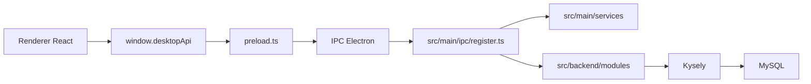
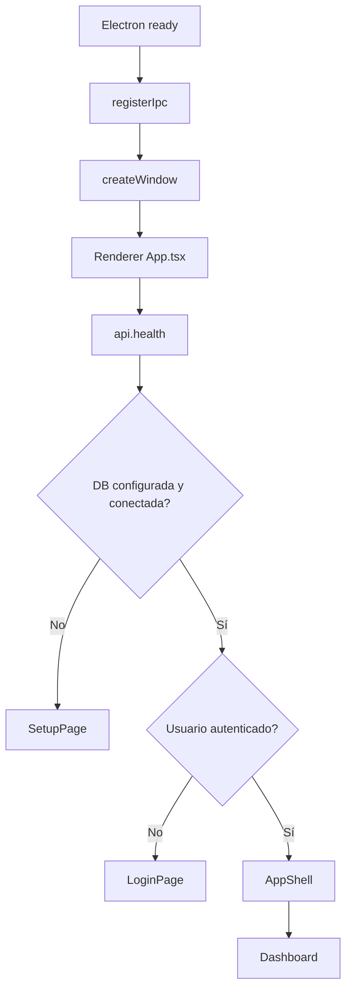
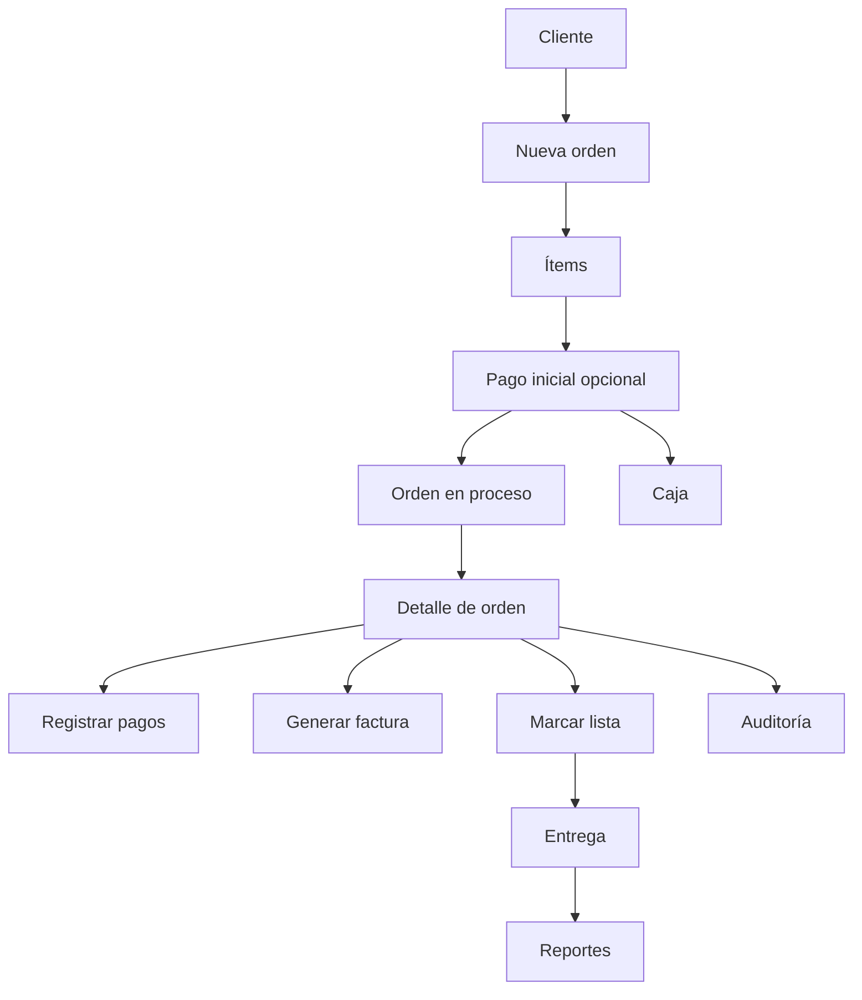

# Documentación Técnica de LavaSuite

## Resumen

LavaSuite es una aplicación de escritorio para lavandería y sastrería. Corre sobre Electron y separa claramente:

- interfaz en `renderer`
- integración con sistema operativo en `main`
- lógica de negocio y acceso a datos en `backend`
- contratos compartidos en `shared`

La aplicación está orientada a operación local por instalación, con base de datos MySQL propia y generación de instaladores para Windows.

## Arquitectura general



## Capas del proyecto

### `src/renderer`

Contiene la interfaz:

- páginas
- formularios
- tablas
- navegación
- hooks
- estilos

Desde aquí nunca se habla directo con Node ni con MySQL. Todo pasa por `window.desktopApi`.

### `src/main`

Contiene la parte Electron:

- creación de ventana
- preload
- registro de canales IPC
- servicios dependientes del sistema operativo
- selección de carpetas
- impresión
- exportación a PDF
- apertura de enlaces externos

### `src/backend`

Contiene la lógica real del negocio:

- autenticación
- clientes
- órdenes
- pagos
- facturas
- entregas
- caja
- gastos
- garantías
- reportes
- auditoría
- configuración
- usuarios

### `src/shared`

Contiene tipos TypeScript compartidos entre renderer y main/backend.

## Flujo de arranque



Orden práctico de pantallas:

1. carga inicial
2. validación de salud de la app
3. configuración inicial MySQL si hace falta
4. login
5. dashboard

## Navegación principal

Rutas registradas:

- `/`
- `/clientes`
- `/ordenes`
- `/ordenes/nueva`
- `/ordenes/:orderId`
- `/pagos`
- `/facturacion`
- `/facturas/:orderId`
- `/caja`
- `/entregas`
- `/gastos`
- `/garantias`
- `/inventario`
- `/reportes`
- `/whatsapp`
- `/configuracion`
- `/usuarios`
- `/auditoria`

## Módulos funcionales

### Clientes

- alta
- edición
- búsqueda
- bloqueo de eliminación cuando hay órdenes asociadas

### Órdenes

- creación con múltiples ítems
- edición
- cancelación
- cambio de estado
- notas
- validaciones de negocio

### Pagos

- pago simple
- pago por múltiples métodos
- actualización de saldos
- integración con caja

### Facturación

- generación desde orden
- reutilización/refresco de factura existente
- vista térmica
- código de barras
- guardado PDF

### Entregas

- órdenes prometidas para hoy
- órdenes listas para entregar
- órdenes entregadas hoy
- órdenes activas en lavandería
- impresión térmica
- exportación PDF por sección

### Caja

- apertura
- cierre
- movimientos derivados de pagos y devoluciones

### Gastos

- registro de egresos
- integración con reportes

### Garantías

- apertura
- cambio de estado
- seguimiento

### Reportes

- diario
- mensual
- anual
- personalizado
- impresión térmica
- exportación PDF

### Auditoría

- listado por día
- detalle legible por evento
- enfoque orientado a usuario final, no solo técnico

### Configuración

- datos del negocio
- logo
- políticas
- ruta de salida PDF
- contraseña administrativa protegida

### Inventario

Hoy funciona como catálogo de servicios. No es inventario físico completo.

## Flujo operativo del usuario



## Persistencia y base de datos

La app usa MySQL y Kysely.

Puntos relevantes:

- el esquema está definido en `src/backend/db/schema.ts`
- las migraciones SQL viven en `src/backend/db/migrations`
- la conexión local se administra desde servicios de `main`
- el chequeo de salud y migración ocurre al arrancar

## Integración entre capas

Ejemplos típicos:

- renderer llama `api.listOrders()`
- `api` usa `window.desktopApi`
- `preload` expone la función
- `ipcMain` recibe y delega
- un servicio backend consulta o escribe en MySQL
- el resultado vuelve como `success/data` o `success/error`

## Archivos privados y restricciones del repositorio

Este repositorio no incluye todos los elementos necesarios para compilar, distribuir o usar ciertas integraciones sensibles.

No se suben al repositorio:

- `.env`
- `.env.masterkey.enc`
- `google-oauth.json`

Esos archivos son privados y los conserva únicamente el equipo desarrollador autorizado.

## Clave maestra de compilación

La app usa una validación de clave maestra en scripts sensibles del pipeline.

Eso aplica especialmente a:

- `npm run build`
- `npm run dist`
- `npm run dist:win`
- scripts de seguridad relacionados

Consecuencia práctica:

- clonar el repo no es suficiente para empaquetar la app
- aunque el código esté presente, el build protegido falla sin la clave
- la clave maestra no está almacenada en el repositorio
- solo los desarrolladores autorizados pueden ejecutar build/distribución completos

## Build y distribución

Scripts principales:

- `npm run dev`
- `npm run build`
- `npm run typecheck`
- `npm run lint`
- `npm run dist:win`
- `npm run dist:win:publish`

### `npm run dist:win`

Genera instalador Windows localmente sin publicar release.

Salida esperada:

- `release/*.exe`
- `release/win-unpacked/`

### `npm run dist:win:publish`

Genera y publica release de Windows. Requiere además credenciales de publicación.

## GitHub publish y `GH_TOKEN`

Si se usa publicación automática con Electron Builder, se necesita:

- `GH_TOKEN`

Sin ese token, el empaquetado puede compilar pero fallará la fase de publicación.

## Icono de la aplicación Windows

La build está configurada para tomar el icono desde:

- `resources/icon.ico`

Esa ruta sí se versiona y puede reemplazarse por el icono final del proyecto.

## Estructura de carpetas relevante

```text
src/
  backend/
    db/
      schema.ts
      migrations/
    modules/
      audit/
      auth/
      cash/
      clients/
      deliveries/
      expenses/
      invoices/
      orders/
      payments/
      reports/
      settings/
      users/
      warranties/
  main/
    ipc/
    services/
    main.ts
    preload.ts
  renderer/
    modules/
    services/
    ui/
    styles/
  shared/
    types.ts
resources/
  icon.ico
```

## Estado actual

LavaSuite ya cubre el flujo principal de negocio y empaquetado Windows. El código del repositorio es suficiente para estudiar, extender y mantener la app, pero no incluye secretos, archivos privados ni credenciales de compilación protegida.
